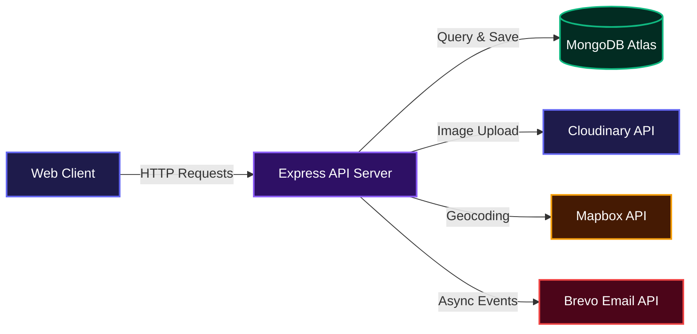
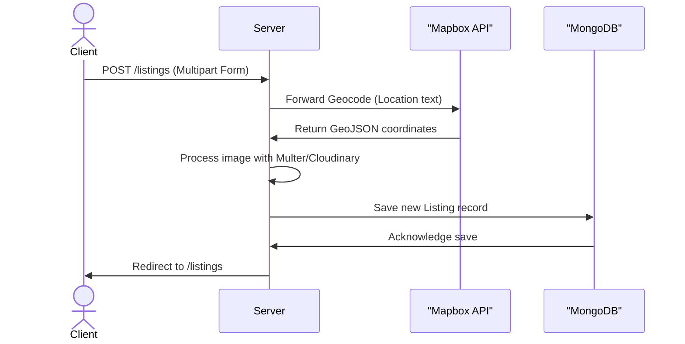
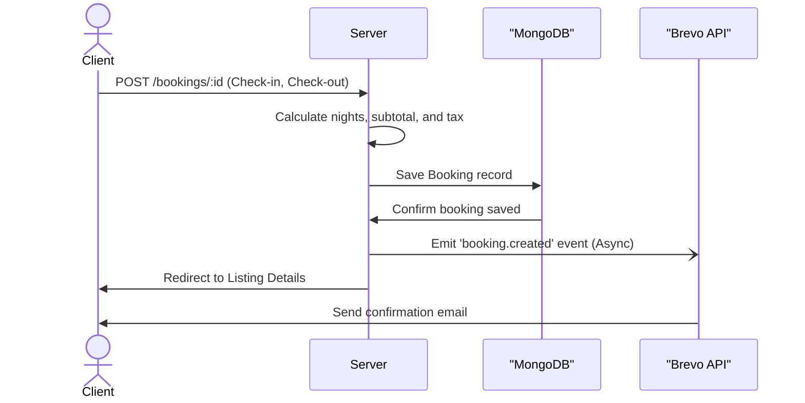

# 🏙️ UrbanStay
> A modern rental platform to discover, list, and book unique stays.

A full-stack Airbnb-inspired property rental platform built with Node.js, Express, and MongoDB. UrbanStay lets users discover, list, review, and book unique stays around the world, complete with interactive maps, image uploads, secure authentication, and automated booking confirmation emails.


---

## 🏗️ System Architecture



---

## 🌐 Live Demo

👉 https://urbanstay-81ly.onrender.com

---

## ✨ Features

* **Browse & Search** - Explore listings or search by location/country with category filters.
* **Listings CRUD** - Create, edit, delete listings with image uploads.



* **Bookings** - Date-based booking with automatic pricing and tax calculation.



* **My Bookings** - View all your past and upcoming bookings in one place.
* **Cancel Booking** - Cancel any confirmed booking with a single click.
* **Booking Confirmation Email** - Automated email sent to users upon booking via Brevo.
* **Reviews** - Add and manage user reviews with star ratings.
* **Interactive Maps** - Mapbox integration for location visualization.
* **Image Uploads** - Cloudinary + Multer integration.
* **Authentication** - Passport.js with session-based login.
* **Flash Messages** - Real-time feedback for user actions.
* **Responsive UI** - Built with EJS and Bootstrap.

---

## 💡 Key Highlights

* Full-stack MVC architecture
* RESTful routing & middleware design
* Event-driven architecture using Node.js EventEmitter
* Automated transactional emails via Brevo API
* Secure authentication system
* Cloud-based media storage
* Interactive map integration
* CI/CD Pipeline Configured

---

## 🛠️ Tech Stack

| Layer          | Technology                      |
| -------------- | ------------------------------- |
| Runtime        | Node.js                         |
| Framework      | Express.js                      |
| Templating     | EJS + EJS-Mate                  |
| Database       | MongoDB Atlas + Mongoose        |
| Authentication | Passport.js                     |
| Sessions       | express-session + connect-mongo |
| File Uploads   | Multer + Cloudinary             |
| Maps           | Mapbox GL JS                    |
| Email Service  | Brevo (Transactional Email API) |
| Validation     | Joi                             |

---

## 🚀 Getting Started

### Prerequisites

* Node.js v18+
* MongoDB Atlas account
* Cloudinary account
* Mapbox account
* Brevo account (free, 300 emails/day)

### Installation

```bash
git clone https://github.com/Anas2694/UrbanStay.git
cd UrbanStay
npm install
```

---

### Environment Variables

Create a `.env` file in the root directory:

```env
ATLASDB_URL=your_mongodb_connection_string
SECRET=your_session_secret

CLOUD_NAME=your_cloudinary_cloud_name
CLOUD_API_KEY=your_cloudinary_api_key
CLOUD_API_SECRET=your_cloudinary_api_secret

MAP_TOKEN=your_mapbox_access_token

BREVO_API_KEY=your_brevo_api_key
```

---

### Run the App

```bash
node app.js
```

Visit: **http://localhost:8080**

---

## 📁 Project Structure

```text
UrbanStay/
├── .gitignore
├── app.js                   # Application entry point
├── cloudConfig.js           # Cloudinary configuration
├── middleware.js            # Authentication middlewares
├── package.json
├── schema.js                # Joi validation schemas
├── models/
│   ├── bookings.js
│   ├── listings.js
│   ├── reviews.js
│   ├── user.js
│   └── init/
│       ├── data.js          # Sample initial data
│       └── index.js         # Database seed script
├── routes/
│   ├── booking.js
│   ├── listing.js
│   ├── review.js
│   └── user.js
├── services/
│   └── notificationService.js  # Brevo integration
├── utils/
│   ├── ExpressError.js
│   ├── eventBus.js             # Local event emitter
│   ├── wrapAsync.js
│   └── controllers/            # Route controllers
│       ├── listings.js
│       ├── reviews.js
│       └── users.js
└── views/
    ├── error.ejs
    ├── bookings/
    ├── includes/
    ├── layouts/
    ├── listings/
    └── users/
```

---

## 🗺️ Routes Overview

| Method | Route                            | Description                           |
| ------ | -------------------------------- | ------------------------------------- |
| GET    | `/listings`                      | Retrieve all listings                 |
| POST   | `/listings`                      | Create a new listing                  |
| GET    | `/listings/new`                  | Render new listing form               |
| GET    | `/listings/search`               | Search listings by location/country   |
| GET    | `/listings/filter/:category`     | Filter listings by category           |
| GET    | `/listings/:id`                  | View specific listing details         |
| PUT    | `/listings/:id`                  | Update a specific listing             |
| DELETE | `/listings/:id`                  | Delete a specific listing             |
| GET    | `/listings/:id/edit`             | Render edit listing form              |
| POST   | `/listings/:id/reviews`          | Submit a review for a listing         |
| DELETE | `/listings/:id/reviews/:reviewId`| Delete a specific review              |
| GET    | `/bookings/my-bookings`          | View user's booking history           |
| POST   | `/bookings/:id`                  | Create a booking for a listing        |
| PATCH  | `/bookings/:id/cancel`           | Cancel an existing booking            |
| GET    | `/signup`                        | Render signup page                    |
| POST   | `/signup`                        | Register a new user                   |
| GET    | `/login`                         | Render login page                     |
| POST   | `/login`                         | Authenticate user credentials         |
| GET    | `/logout`                        | Log out current user                  |
| GET    | `/demouser`                      | Create and login a temporary demo user|

---

## 📧 Email Notifications

When a booking is confirmed, an automated email is sent to the user containing:

* Property name and location
* Check-in and check-out dates
* Number of nights
* Total amount with 18% GST

This is implemented using an **event-driven architecture**. The booking controller emits a `booking.created` event which the notification service listens to asynchronously, so email delivery never slows down the booking response.

---

## 🧠 Challenges & Learnings

* Implemented secure authentication using Passport.js
* Integrated Cloudinary for scalable image storage
* Designed RESTful APIs and middleware flow
* Built an event-driven notification system with Node.js EventEmitter
* Integrated Brevo transactional email API for booking confirmations
* Managed relationships between users, listings, reviews, and bookings

---

## 🚀 Future Improvements

* Wishlist / Save listings feature
* Host dashboard
* Advanced search & filters
* Real-time booking availability calendar

---

## 👨‍💻 Author

**Mohd Viquaruddin Anas**

---

## 📄 License

This project is open source under the ISC License.

[](https://dokugen.samueltuoyo.com)
